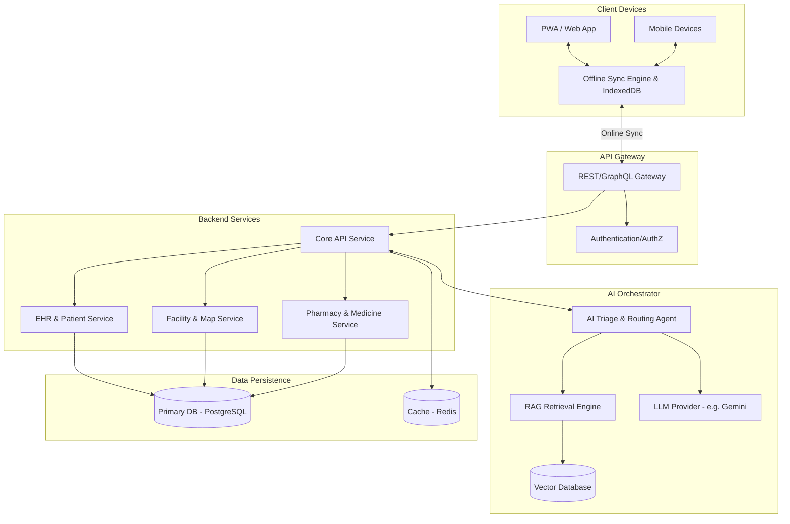

# M0_MEDIBOT_SIH26133_AUDIT

## 1. Executive Summary
This document serves as Milestone 0 (M0) — a comprehensive engineering audit and transformation blueprint for the MediBot-AI repository, targeting Smart India Hackathon problem statement SIH26133 ("Accessibility and quality of public healthcare services, particularly in rural and underserved areas"). 

**CRITICAL FINDING:** The provided repository path (`c:\Users\LOKESH\Documents\Rural MediBot`) is currently **completely empty**. There is no existing codebase, architecture, or features implemented. Consequently, this audit establishes a greenfield baseline and focuses heavily on the target architecture, gap analysis (which is currently 100%), and the milestone blueprint required to build the "MediBot — Offline-First AI Rural Healthcare Accessibility & Care Coordination Platform" from scratch.

## 2. Current Repository Structure
The repository is entirely empty.
- **Directories:** 0
- **Files:** 0

## 3. Current Architecture
None. There is no existing frontend, backend, database, or AI integration.

## 4. Working Features
None (BLACK).

## 5. Partial Features
None.

## 6. Static/Mock Features
None.

## 7. Missing Features
All requested features are currently missing (BLACK):
- Frontend client (PWA)
- Backend API
- Database
- Offline-first capabilities
- AI/LLM integrations
- RAG system
- Authentication/Authorization
- Voice/Multilingual support
- Medical Navigation/Maps
- Medicine Access
- Role-based dashboards (Patient, Doctor, ASHA, Admin)

## 8. Frontend Audit
**Status:** Non-existent.
**Technical Debt:** N/A.

## 9. Backend Audit
**Status:** Non-existent.
**Technical Debt:** N/A.

## 10. Database Audit
**Status:** Non-existent. No tables, models, or configurations exist.

## 11. AI Audit
**Status:** Non-existent. No LLM integration, prompt architecture, or guardrails exist.

## 12. RAG Audit
**Status:** Non-existent. No document ingestion, vector database, or retrieval mechanisms exist.

## 13. Voice/Language Audit
**Status:** Non-existent. No STT, TTS, or translation services are implemented.

## 14. Offline-First Gap Analysis
Since there is no existing code, the gap is 100%. To achieve the required offline-first capability, the target architecture MUST implement:
- **Service Worker:** For caching static assets and API responses.
- **PWA Manifest:** For installability on mobile devices (Android/iOS).
- **IndexedDB/Local Storage (e.g., Dexie.js or WatermelonDB):** For robust local data storage of patient records, cached facilities, and offline forms.
- **Sync Engine:** A robust queue-based system (e.g., using background sync API or manual sync triggers) to capture offline requests (referrals, new patient registrations, vitals) and push them when connectivity is restored.
- **Conflict Resolution:** Strategy for handling concurrent modifications (e.g., server-wins or timestamp-based merging).
- **Security:** Local encryption of sensitive medical data using device-provided security or local encryption keys.

## 15. Healthcare Navigation Gap
Current support: 0%.
Required Architecture:
- **Location Services:** HTML5 Geolocation API (when online/available).
- **Spatial Database:** Backend support (e.g., PostGIS in PostgreSQL) to query PHC/CHC/Hospitals by radius.
- **Offline Dataset:** Critical local facilities must be synced to the device's IndexedDB during online mode for offline discovery.
- **Mapping Provider:** Integration with a mapping service (e.g., Mapbox, Google Maps, or Leaflet with OpenStreetMap) for routing, with graceful degradation to static text directions or cached map tiles when offline.

## 16. Medicine Access Gap
Current support: 0%.
Required Architecture:
- **Database Schema:** Entities for Medicines, Pharmacies, Inventory, and Prescriptions.
- **Search & Compare Engine:** Logic to accept a valid prescription and query local/remote pharmacy inventories for price, availability, and distance.
- **Fulfillment Workflow:** Order placement system (self-pickup vs. doorstep delivery).
- **Safety Guardrails:** Strict system prompts and backend validations to prevent the AI from autonomously prescribing medications.

## 17. Patient / Doctor / ASHA / Admin Gap
All roles are completely unimplemented (BLACK). 

**Required Workflows:**
- **PATIENT (BLACK):** Registration, profile, health records (EHR), AI assistant, appointments, referrals, medicine access.
- **DOCTOR (BLACK):** Patient list, medical history, AI summaries, triage results, consultations, referrals, prescriptions.
- **ASHA/ANM (BLACK):** Patient registration, offline village visits, vitals recording, screening, sync mechanisms.
- **ADMIN (BLACK):** User management, facility management, analytics, audit logs.

## 18. Security Audit
**Status:** Non-existent.
**Future Requirements:** 
- JWT for stateless authentication.
- Strong password hashing (Argon2/bcrypt).
- Strict RBAC (Role-Based Access Control) middleware.
- PII/PHI encryption at rest and in transit.
- Prompt injection protection for the AI subsystem.

## 19. SIH26133 Requirement Matrix

| Requirement | Current Status | Evidence | Gap | Priority | Future Milestone |
| :--- | :--- | :--- | :--- | :--- | :--- |
| A. Rural accessibility | BLACK | No codebase | 100% | P0 | M1, M4 |
| B. Offline-first operation | BLACK | No codebase | 100% | P0 | M4 |
| C. Low-bandwidth operation | BLACK | No codebase | 100% | P0 | M4, M5 |
| D. Multilingual healthcare | BLACK | No codebase | 100% | P1 | M8 |
| E. Voice-based interaction | BLACK | No codebase | 100% | P1 | M8 |
| F. AI-assisted triage | BLACK | No codebase | 100% | P0 | M6 |
| G. Emergency escalation | BLACK | No codebase | 100% | P0 | M6, M11 |
| H. Facility discovery | BLACK | No codebase | 100% | P0 | M5 |
| I. Real-time facility info | BLACK | No codebase | 100% | P1 | M5 |
| J. Map-based navigation | BLACK | No codebase | 100% | P1 | M5 |
| K. Doctor consultation | BLACK | No codebase | 100% | P0 | M9 |
| L. Electronic Health Records | BLACK | No codebase | 100% | P0 | M3 |
| M. ASHA/ANM workflows | BLACK | No codebase | 100% | P0 | M9 |
| N. Medicine availability | BLACK | No codebase | 100% | P1 | M10 |
| O. Medicine price compare | BLACK | No codebase | 100% | P1 | M10 |
| P. Affordable pharmacy rec. | BLACK | No codebase | 100% | P1 | M10 |
| Q. Doorstep medicine | BLACK | No codebase | 100% | P2 | M10 |
| R. Maternal healthcare | BLACK | No codebase | 100% | P1 | M7, M9 |
| S. Child healthcare | BLACK | No codebase | 100% | P1 | M7, M9 |
| T. Chronic disease tracking | BLACK | No codebase | 100% | P2 | M11 |
| U. Inventory monitoring | BLACK | No codebase | 100% | P2 | M12 |
| V. Continuity of care | BLACK | No codebase | 100% | P1 | M11 |
| W. Analytics | BLACK | No codebase | 100% | P2 | M12 |
| X. RAG knowledge base | BLACK | No codebase | 100% | P0 | M7 |
| Y. Security and privacy | BLACK | No codebase | 100% | P0 | M2, M13 |
| Z. Auditability | BLACK | No codebase | 100% | P1 | M13 |
| AA. Public deployment | BLACK | No codebase | 100% | P0 | M15 |
| AB. Resilient failure | BLACK | No codebase | 100% | P1 | M4, M15 |

## 20. Final Target Architecture

**Offline Mode Flow:** Device -> Local Storage -> Offline Services -> (Queue) -> Sync Engine -> Cloud (when connectivity returns).

## 21. 24-Hour Hackathon Prioritization

**MUST HAVE (P0 - Core Demo):**
- PWA foundation with basic offline caching.
- Authentication (Patient, Doctor, ASHA).
- Basic EHR database (CRUD operations).
- AI Triage Agent (LLM integration with safety guardrails).
- Facility Discovery (Static/Mocked data for demo if necessary, but functional search).
- ASHA offline data collection form with queue-to-sync.

**SHOULD HAVE (P1 - High Value):**
- RAG for verified medical queries.
- Voice input (STT).
- Multilingual support (at least English + Hindi).
- Medicine availability search.

**IF TIME ALLOWS (P2 - Enhancements):**
- Real map integration.
- Admin dashboard analytics.
- Automated SMS/WhatsApp notifications.

**FUTURE (P3):**
- Full live inventory tracking.
- Complex chronic disease ML prediction.
- Real-time video telemedicine.

## 22. Proposed Milestones

Since this is a greenfield project, the sequence must build from the ground up:

*   **M0 Audit:** (Complete) Establish baseline and architecture.
*   **M1 Foundation:** Setup monorepo/structure, init PWA (e.g., Next.js/React or Vite), init Backend (e.g., Node/Express or Python/FastAPI), Docker setup.
*   **M2 Authentication & DB:** Setup PostgreSQL, Prisma/ORM, JWT Auth, and Role definitions (Patient, Doctor, ASHA, Admin).
*   **M3 EHR & Profiles:** Patient data models, CRUD APIs, Doctor-Patient linking.
*   **M4 Offline-first Engine:** Service worker registration, IndexedDB setup (Dexie.js), offline queue architecture.
*   **M5 Healthcare Facility Engine:** Hospital/PHC models, location-based querying APIs.
*   **M6 AI Triage Foundation:** LLM integration, prompt engineering for preliminary triage, emergency detection guardrails.
*   **M7 RAG Integration:** Document parsing, embeddings setup, Vector DB (e.g., Pinecone/Milvus/pgvector), knowledge retrieval.
*   **M8 Voice/Multilingual:** Web Speech API integration, translation services.
*   **M9 Doctor/ASHA Workflows:** Offline visit forms, prescription generation UI, referral logic.
*   **M10 Medicine Access:** Pharmacy/Medicine models, price comparison logic.
*   **M11 Emergency/Follow-up:** Escalation logic, action items.
*   **M12 Admin/Analytics:** Basic dashboard for metrics.
*   **M13 Security & Audit:** Audit logs, hardening.
*   **M14 Testing:** Unit and E2E tests.
*   **M15 Deployment & Final Polish:** Cloud deployment (e.g., Vercel + Render/AWS), environment configuration.

## 23. Technical Risks
1.  **Offline Data Integrity:** Synchronizing complex state (like a modified medical record) from an offline device to a central DB without conflicts is hard. *Mitigation: Timestamp-based last-write-wins or immutable event logs.*
2.  **LLM Hallucinations:** Giving medical advice is highly dangerous. *Mitigation: Strict system prompts enforcing "preliminary triage only, consult a doctor", forced RAG context, and rule-based emergency overrides.*
3.  **Scope Creep:** Building Maps, RAG, Offline Sync, and E-commerce (medicine) in a hackathon is immense. *Mitigation: Stick strictly to the "MUST HAVE" priorities.*

## 24. Recommended Next Step
Proceed to **M1 Foundation**. This will require choosing the tech stack (e.g., React/Next.js for frontend, Node.js or Python for backend) and initializing the repository structure.
